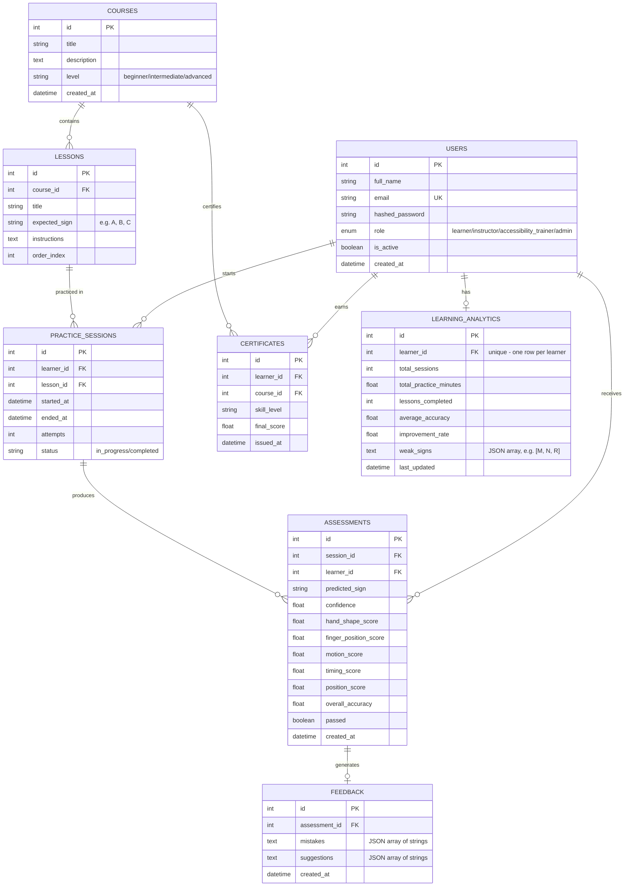

# ER Diagram — Sign Language Learning & Assessment Platform

**Owner:** Intern 5 (Database & DevOps)
**Milestone 1 deliverable:** Day 1 — "Reviewed ER diagram approved by the team; shared with Interns 2 and 4."

This diagram covers every table needed across all four other domains'
Milestone 1 requirements: Users/Roles (Intern 2), Lessons/Modules
(Intern 2), Practice Sessions/Assessments/Feedback/Analytics (Intern 4).

Renders automatically on GitHub - just view this file in the repo.

## Design notes for the team

- **RBAC via single `role` enum column** on `USERS`, not a separate
  roles table — simpler for Milestone 1's 4 fixed roles
  (Learner/Instructor/Accessibility Trainer/Admin). Intern 2's
  middleware reads this column directly.
- **`LESSONS.expected_sign`** is the single field Intern 3's AI service
  and Intern 4's Assessment Service both need to agree on — it's the
  ground truth every prediction gets compared against.
- **`ASSESSMENTS`** stores the 5 weighted score parameters Intern 4
  specified on Day 1 (hand shape, finger position, timing, motion,
  position) as individual columns rather than a JSON blob, so they're
  queryable for analytics later.
- **`FEEDBACK.mistakes`/`suggestions`** are stored as JSON-encoded text
  rather than separate tables, since Milestone 1 only needs a flat list
  of rule-based messages per attempt, not structured mistake records.
- **`LEARNING_ANALYTICS`** is one row per learner (not one row per
  session) — it's a continuously-updated rollup, matching Intern 4's
  Day 6 "aggregate a learner's session and assessment history into
  simple stats" requirement.

Full implementation (SQLAlchemy ORM models matching this diagram
exactly) is in `app/models.py`.
