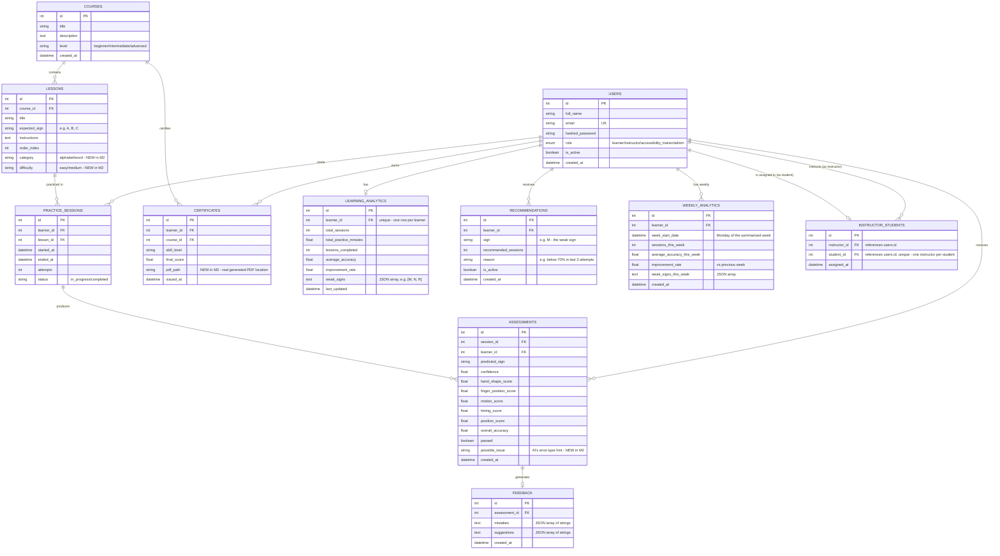

# ER Diagram — Sign Language Learning & Assessment Platform

**Owner:** Intern 5 (Database & DevOps)
**Milestone 1 deliverable:** Day 1 — ER diagram covering Users/Roles, Lessons/Modules, Practice Sessions, Assessments, Feedback, Analytics
**Milestone 2 update:** Day 2 — added Recommendations, Instructor-Student mapping, Weekly Analytics tables; extended Lessons (category/difficulty), Assessments (possible_issue), Certificates (pdf_path)

Renders automatically on GitHub - just view this file in the repo.

## Design notes for the team

- **RBAC via single `role` enum column** on `USERS`, not a separate
  roles table — simpler for Milestone 1's 4 fixed roles
  (Learner/Instructor/Accessibility Trainer/Admin). Intern 2's
  middleware reads this column directly.
- **`LESSONS.expected_sign`** is the single field Intern 3's AI service
  and Intern 4's Assessment Service both need to agree on — it's the
  ground truth every prediction gets compared against.
- **`ASSESSMENTS`** stores the 5 weighted score parameters Intern 4
  specified on Day 1 (hand shape, finger position, timing, motion,
  position) as individual columns rather than a JSON blob, so they're
  queryable for analytics later.
- **`FEEDBACK.mistakes`/`suggestions`** are stored as JSON-encoded text
  rather than separate tables, since Milestone 1 only needs a flat list
  of rule-based messages per attempt, not structured mistake records.
- **`LEARNING_ANALYTICS`** is one row per learner (not one row per
  session) — it's a continuously-updated rollup, matching Intern 4's
  Day 6 "aggregate a learner's session and assessment history into
  simple stats" requirement.

### Milestone 2 additions

- **`INSTRUCTOR_STUDENTS`** is a simple mapping table, not a many-to-many
  join in the usual sense — per the SRS, each student has exactly ONE
  instructor (`student_id` is unique), but one instructor can have many
  students. If the team later wants students to have multiple
  instructors, this table would need `student_id`'s unique constraint
  removed.
- **`RECOMMENDATIONS`** is append-only with an `is_active` flag rather
  than being deleted when resolved — this preserves history (so
  Instructors/Admins can see what a learner used to struggle with, not
  just their current weak points).
- **`WEEKLY_ANALYTICS`** is separate from `LEARNING_ANALYTICS` on
  purpose: `LEARNING_ANALYTICS` is an always-current all-time rollup
  (one row, continuously updated), while `WEEKLY_ANALYTICS` is a
  historical snapshot (one new row per learner per week), so Intern 4's
  weekly summary logic has real week-over-week data to compare against.
- **`CERTIFICATES.pdf_path`** stores a file path/URL rather than the PDF
  bytes themselves — keeps the database small and lets Intern 4 use
  whatever free storage approach is simplest (local file, or the free
  hosting provider's disk).

Full implementation (SQLAlchemy ORM models matching this diagram
exactly) is in `app/models.py`.
